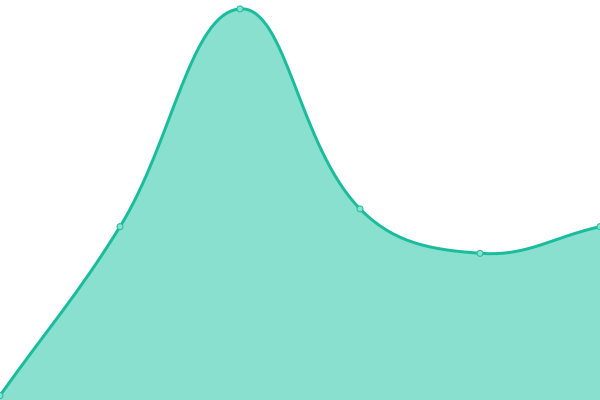
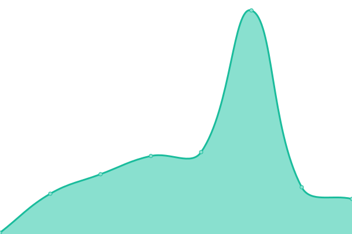
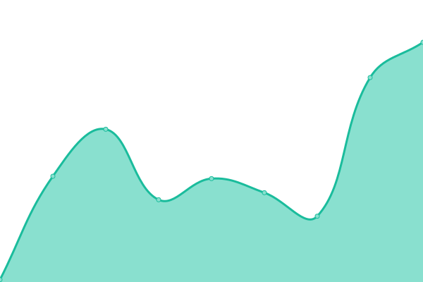
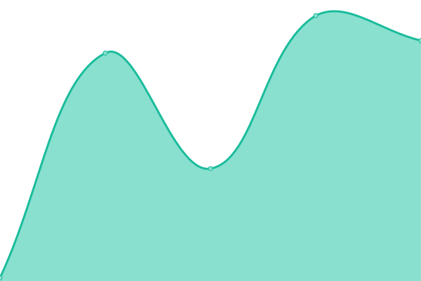

# [📈 Live Status](https://demo.upptime.js.org): <!--live status--> **🟧 Partial outage**

This repository contains the open-source uptime monitor and status page for [Upptime](https://upptime.js.org), powered by [Upptime](https://github.com/upptime/upptime).

With [Upptime](https://upptime.js.org), you can get your own unlimited and free uptime monitor and status page, powered entirely by a GitHub repository. We use [Issues](https://github.com/upptime/upptime/issues) as incident reports, [Actions](https://github.com/jeakob/upptime/actions) as uptime monitors, and [Pages](https://demo.upptime.js.org) for the status page.

<!--start: status pages-->
<!-- This summary is generated by Upptime (https://github.com/upptime/upptime) -->
<!-- Do not edit this manually, your changes will be overwritten -->
<!-- prettier-ignore -->
| URL | Status | History | Response Time | Uptime |
| --- | ------ | ------- | ------------- | ------ |
|  [Google](https://www.google.com) | 🟩 Up | [google.yml](https://github.com/jeakob/upptime/commits/HEAD/history/google.yml) | 

 87ms
     
 | 

<a href="https://jeakob.github.io/upptime/history/google">99.59%</a>
    

|  [Wikipedia](https://en.wikipedia.org) | 🟩 Up | [wikipedia.yml](https://github.com/jeakob/upptime/commits/HEAD/history/wikipedia.yml) | 

 166ms
     
 | 

<a href="https://jeakob.github.io/upptime/history/wikipedia">100.00%</a>
    

|  [Hacker News](https://news.ycombinator.com) | 🟩 Up | [hacker-news.yml](https://github.com/jeakob/upptime/commits/HEAD/history/hacker-news.yml) | 

 349ms
     
 | 

<a href="https://jeakob.github.io/upptime/history/hacker-news">100.00%</a>
    

|  [BBC](https://www.bbc.co.uk) | 🟩 Up | [bbc.yml](https://github.com/jeakob/upptime/commits/HEAD/history/bbc.yml) | 

 264ms
     
 | 

<a href="https://jeakob.github.io/upptime/history/bbc">100.00%</a>
    

|  KASM | 🟩 Up | [kasm.yml](https://github.com/jeakob/upptime/commits/HEAD/history/kasm.yml) | 

 1973ms
     
 | 

<a href="https://jeakob.github.io/upptime/history/kasm">12.15%</a>
    

|  KASM1 | 🟥 Down | [kasm-1.yml](https://github.com/jeakob/upptime/commits/HEAD/history/kasm-1.yml) | 

 49ms
     
 | 

<a href="https://jeakob.github.io/upptime/history/kasm-1">13.06%</a>
    

|  KASM2 | 🟥 Down | [kasm-2.yml](https://github.com/jeakob/upptime/commits/HEAD/history/kasm-2.yml) | 

 46ms
     
 | 

<a href="https://jeakob.github.io/upptime/history/kasm-2">3.06%</a>
    

|  KASM3 | 🟩 Up | [kasm-3.yml](https://github.com/jeakob/upptime/commits/HEAD/history/kasm-3.yml) | 

 61ms
     
 | 

<a href="https://jeakob.github.io/upptime/history/kasm-3">100.00%</a>
    

|  KASM4 | 🟩 Up | [kasm-4.yml](https://github.com/jeakob/upptime/commits/HEAD/history/kasm-4.yml) | 

 49ms
     
 | 

<a href="https://jeakob.github.io/upptime/history/kasm-4">100.00%</a>
    

|  KASM5 | 🟥 Down | [kasm-5.yml](https://github.com/jeakob/upptime/commits/HEAD/history/kasm-5.yml) | 

 39ms
     
 | 

<a href="https://jeakob.github.io/upptime/history/kasm-5">0.03%</a>
    

|  KASM6 | 🟩 Up | [kasm-6.yml](https://github.com/jeakob/upptime/commits/HEAD/history/kasm-6.yml) | 

 65ms
     
 | 

<a href="https://jeakob.github.io/upptime/history/kasm-6">100.00%</a>
    

|  KASM7 | 🟩 Up | [kasm-7.yml](https://github.com/jeakob/upptime/commits/HEAD/history/kasm-7.yml) | 

 37ms
     
 | 

<a href="https://jeakob.github.io/upptime/history/kasm-7">100.00%</a>
    

|  KASM8 | 🟩 Up | [kasm-8.yml](https://github.com/jeakob/upptime/commits/HEAD/history/kasm-8.yml) | 

 48ms
     
 | 

<a href="https://jeakob.github.io/upptime/history/kasm-8">100.00%</a>
    

|  PORTAINER | 🟥 Down | [portainer.yml](https://github.com/jeakob/upptime/commits/HEAD/history/portainer.yml) | 

 1597ms
     
 | 

<a href="https://jeakob.github.io/upptime/history/portainer">30.32%</a>
    

<!--end: status pages-->

[**Visit our status website →**](https://demo.upptime.js.org)

## 📄 License

- Powered by: [Upptime](https://github.com/upptime/upptime)
- Code: [MIT](./LICENSE) © [Anand Chowdhary](https://anandchowdhary.com), supported by [Pabio](https://pabio.com)
- Data in the `./history` directory: [Open Database License](https://opendatacommons.org/licenses/odbl/1-0/)
