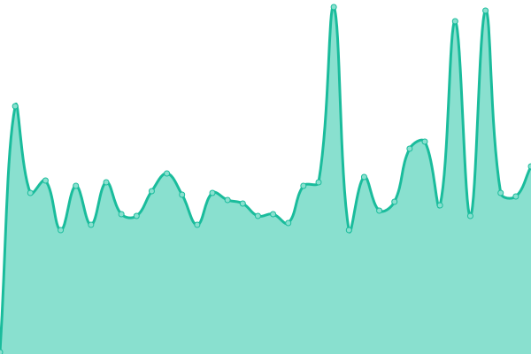
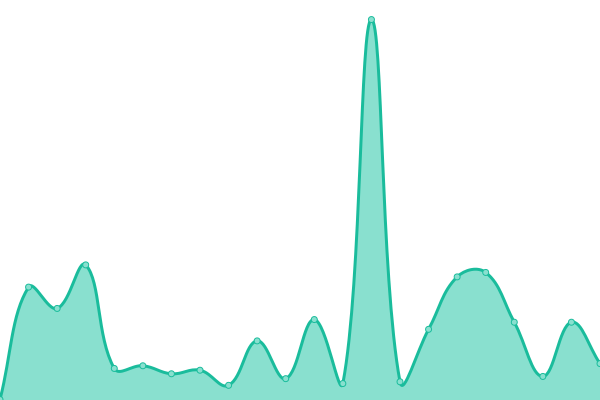
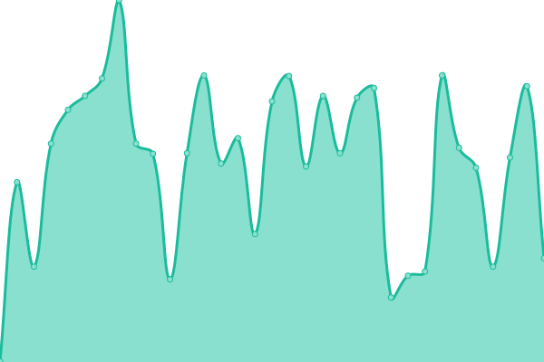
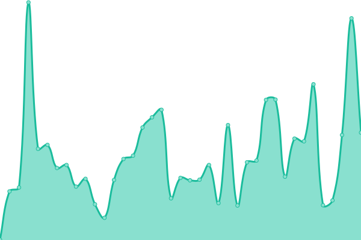
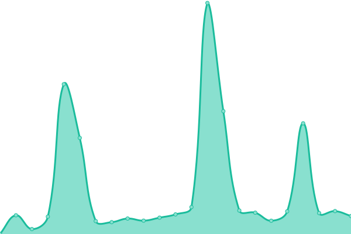
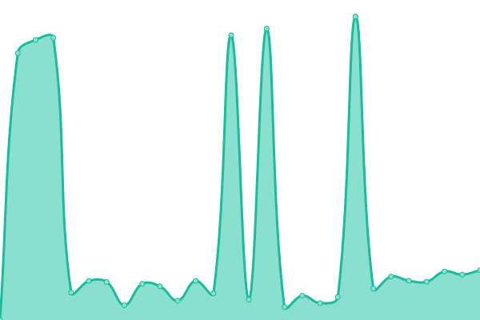

# [📈 Live Status](https://demo.upptime.js.org): <!--live status--> **🟧 Partial outage**

This repository contains the open-source uptime monitor and status page for [Upptime](https://upptime.js.org), powered by [Upptime](https://github.com/upptime/upptime).

With [Upptime](https://upptime.js.org), you can get your own unlimited and free uptime monitor and status page, powered entirely by a GitHub repository. We use [Issues](https://github.com/upptime/upptime/issues) as incident reports, [Actions](https://github.com/jeakob/upptime/actions) as uptime monitors, and [Pages](https://demo.upptime.js.org) for the status page.

<!--start: status pages-->
<!-- This summary is generated by Upptime (https://github.com/upptime/upptime) -->
<!-- Do not edit this manually, your changes will be overwritten -->
<!-- prettier-ignore -->
| URL | Status | History | Response Time | Uptime |
| --- | ------ | ------- | ------------- | ------ |
|  [Google](https://www.google.com) | 🟩 Up | [google.yml](https://github.com/jeakob/upptime/commits/HEAD/history/google.yml) | 

 91ms
     
 | 

<a href="https://jeakob.github.io/upptime/history/google">98.81%</a>
    

|  [Wikipedia](https://en.wikipedia.org) | 🟩 Up | [wikipedia.yml](https://github.com/jeakob/upptime/commits/HEAD/history/wikipedia.yml) | 

 158ms
     
 | 

<a href="https://jeakob.github.io/upptime/history/wikipedia">100.00%</a>
    

|  [Hacker News](https://news.ycombinator.com) | 🟩 Up | [hacker-news.yml](https://github.com/jeakob/upptime/commits/HEAD/history/hacker-news.yml) | 

 328ms
     
 | 

<a href="https://jeakob.github.io/upptime/history/hacker-news">100.00%</a>
    

|  [BBC](https://www.bbc.co.uk) | 🟩 Up | [bbc.yml](https://github.com/jeakob/upptime/commits/HEAD/history/bbc.yml) | 

 286ms
     
 | 

<a href="https://jeakob.github.io/upptime/history/bbc">100.00%</a>
    

|  KASM | 🟩 Up | [kasm.yml](https://github.com/jeakob/upptime/commits/HEAD/history/kasm.yml) | 

 2002ms
     
 | 

<a href="https://jeakob.github.io/upptime/history/kasm">67.74%</a>
    

|  KASM1 | 🟩 Up | [kasm-1.yml](https://github.com/jeakob/upptime/commits/HEAD/history/kasm-1.yml) | 

 74ms
     
 | 

<a href="https://jeakob.github.io/upptime/history/kasm-1">94.76%</a>
    

|  PORTAINER | 🟥 Down | [portainer.yml](https://github.com/jeakob/upptime/commits/HEAD/history/portainer.yml) | 

 1398ms
     
 | 

<a href="https://jeakob.github.io/upptime/history/portainer">93.30%</a>
    

<!--end: status pages-->

[**Visit our status website →**](https://jeakob.github.io/upptime)

## 📄 License

- Powered by: [Upptime](https://github.com/upptime/upptime)
- Code: [MIT](./LICENSE) © [Anand Chowdhary](https://anandchowdhary.com), supported by [Pabio](https://pabio.com)
- Data in the `./history` directory: [Open Database License](https://opendatacommons.org/licenses/odbl/1-0/)
